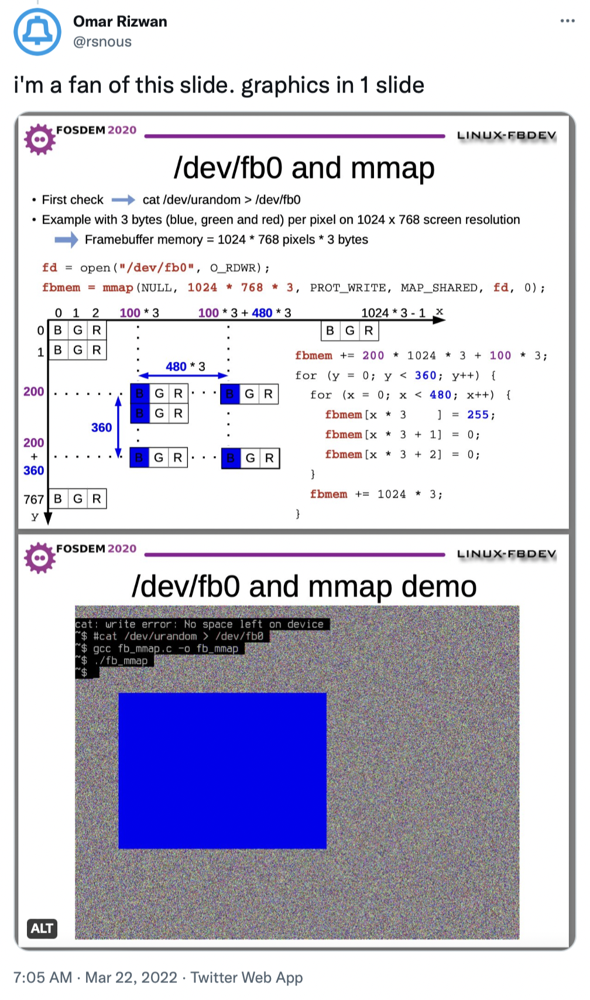
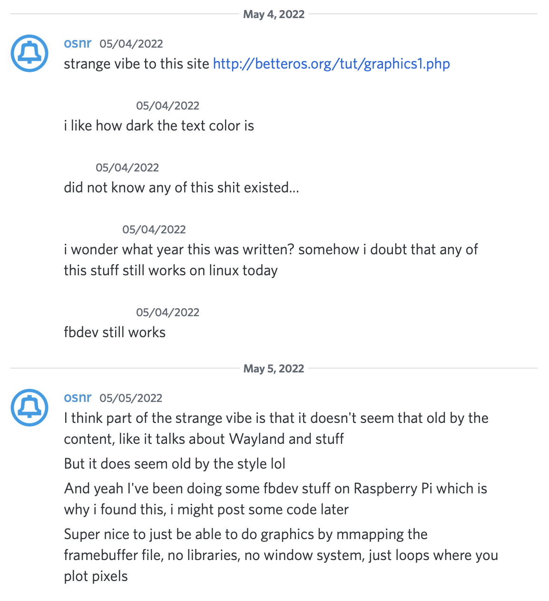
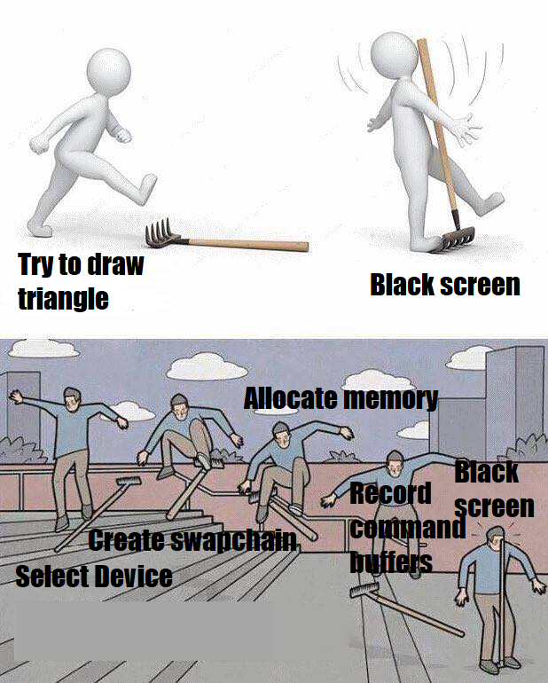
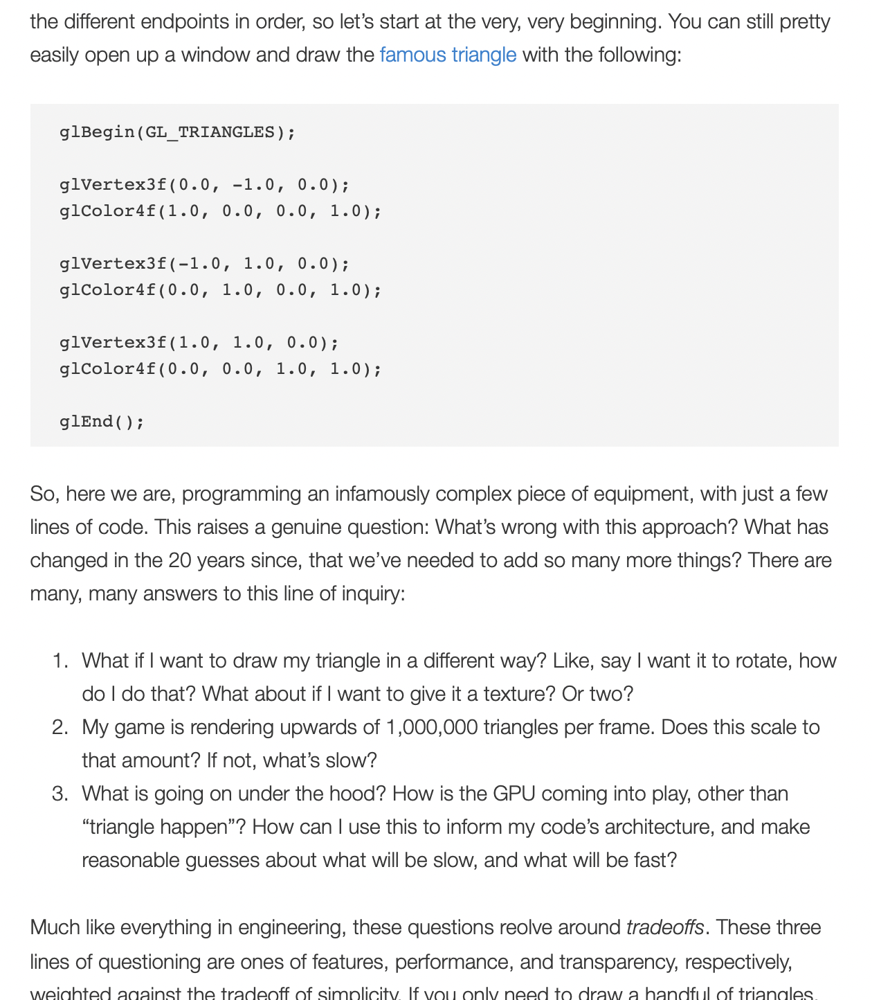
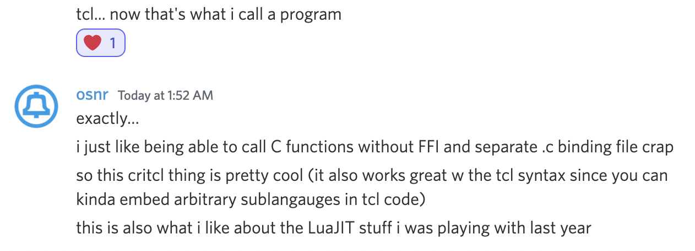

# little-fbdev-critcl-play

<a href="https://twitter.com/rsnous/status/1506225456709873666"></a>

## Usage

Only tested on Pi 4.

I installed Raspberry Pi OS Lite (you don't need and in fact _don't
want_ X -- it'll be more annoying if you have X on, although [it may
be
workable](https://twitter.com/riley_stews/status/1500706011836911617)).

(I bet it would work on other Pi models, at least. I bet it would work
on other Linuxes on other computers, too, although you might need to
adjust the bit layout from 5:6:5 16-bit BGR, to 32-bit BGRA or
whatever.)

Install `tcl` and `critcl`, then run this thing.

```
$ sudo apt install tcl critcl
$ tclsh little-fbdev-critcl-play.tcl
```

The screen should turn green!

## Backstory-ish



([the strange vibe](http://betteros.org/tut/graphics1.php))

so I wanted to share the code :-)

## Cool

Fun to think about how you would implement all the classic graphics
stuff (and how to do it fast).

(and if you were writing your own OS/applications, you could throw out
the parts that are slow or hard to implement. do you really need
PostScript-style paths? how should you specify fonts? how do you scale
and rotate stuff?)

I remember doing things like that in college... rasterization /
rendering in its [purest
form](https://twitter.com/rsnous/status/1500608727296225287), as an
algorithmic/optimization
[problem](https://twitter.com/rsnous/status/1500610427906150406)
rather than a 'find the best incantations to talk to the GPU /
rendering engine / browser' problem.

(even if you ultimately want to use the GPU, now you can think of that
in terms of how it replaces and accelerates parts of this pure
software stack, which somehow 'tames' it, at least in my head)

## The alternatives, I guess: Vulkan (or OpenGL?)

(well, I guess that if I want to state alternatives, I should state
the problem first. I want to put
[graphics](https://twitter.com/rsnous/status/1299457513448828928) [on
the screen](https://twitter.com/rsnous/status/1259114530908454915)
without needing X11 or Wayland installed; I want to talk directly to
Linux.)

there's Vulkan, which I'm told is the cleanest/most modern way to do headless graphics
(and multithreaded graphics, if you end up wanting that too):

<a href="https://twitter.com/provod_/status/1522479843748679681/photo/1"></a>

see [triangle.cpp](https://github.com/SaschaWillems/Vulkan/blob/master/examples/triangle/triangle.cpp):
it's 1236 lines :-)

i really like the look of [this intro blog
post](https://blog.mecheye.net/2020/06/modern-graphics-apis-1-intro/):

<a
href="https://blog.mecheye.net/2020/06/modern-graphics-apis-1-intro/"></a>

(I mean, it makes sense that it's complicated. your GPU is a whole
other computer, one which seems much more ad hoc and proprietary than
your CPU computer, and this is the interface to program that computer)

(I think you can use OpenGL headlessly, too. I do hear that talking to
X is also not that bad if you can call C functions, so that may be a
conceptual alternative.)

TODO: say something about libdrm?? [this post](https://forums.libretro.com/t/retroarch-raspberry-pi-4-vulkan-without-x-howto/31164)

## Why Tcl ??

I've been playing with Tcl a lot recently, and this is a tiny spin-off
of that work. (It's useful to prototype with / lets me dodge the
enormous upfront psychological drain of spinning up an actual graphics
stack.)

turns out critcl is really nice.



(I don't get why I need to use the `bytes` type instead of `char*` in
the `fillRectImpl` function interface. Any ideas? [critcl doc for
reference](https://andreas-kupries.github.io/critcl/doc/files/critcl_pkg.html#7))

Compare to the other `little-` projects I have that use
Lua or LuaJIT instead:

- [little-editor](https://github.com/osnr/little-editor)

- [little-web-server](https://github.com/osnr/little-web-server)

- [little-epoll-fiber-scheduler](https://github.com/osnr/little-epoll-fiber-scheduler)

they have a common vibe: one script you can read & run, that lives in
one file, that talks directly to the OS and uses the real OS functions
(`open`, `connect`, `write`, `ioctl`, whatever) that you can read
about on `man` pages and Stack Overflow and see the stack trace of in
`gdb`. no JNI or Python FFI or Lua FFI or (God forbid) Node FFI stuff
where you have to write some weird C or C++ file and figure out how to
compile and link it
